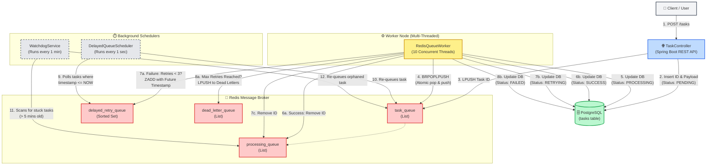

What is this project  actually?
At its core  this project is a Distributed Background Job Processor.
In software development  you never want your users to wait on a loading screen while your server does heavy  slow work. This project solves that problem. It is an architectural  middleman  that takes heavy tasks from your main application  stores them safely  and processes them in the background at its own pace.
A simple analogy: Imagine you run a busy restaurant:
Your API (TaskController) is the Waiter: The waiter's only job is to take the customer's order  say  Got it!   and immediately go help the next customer. They do not cook the food.
Redis is the Ticket Rail: The waiter pins the order ticket to the rail in the kitchen.
Your Java Workers (RedisQueueWorker) are the Chefs: You have 10 chefs (your multi-threaded worker pool). They constantly look at the ticket rail  grab the next ticket  and do the heavy work (cooking) in the background.
PostgreSQL is the Manager's Logbook: It keeps a permanent record of every task (Pending  Processing  Success  Failed).
The Retry & Watchdog System: If a chef accidentally drops a steak  the manager notices  puts a new ticket back on the rail  and tells them to try again (Exponential Backoff Retry). If it fails 3 times  it gets thrown in the trash bin (Dead Letter Queue).

What are the real-world use cases?
If you were building a massive application  you would use this exact system for:
Video/Image Processing (Like YouTube or Instagram): When a user uploads a 4GB video  you can't make them keep the webpage open while you compress it. You instantly say  Upload Complete!  and send a ProcessVideo task to this queue. The workers compress it in the background and notify the user when it's done.
Sending Bulk Emails/Notifications: If you have 100 000 users and need to send a newsletter  doing it in a simple loop would crash your server. Instead  you dump 100 000 tasks into this queue. Your workers will send them out smoothly at a safe speed.
Generating Heavy Reports (Fintech/Banks): When a user clicks  Download 5-Year Bank Statement   it might take the database 30 seconds to generate the PDF. Instead of freezing the website  you give the task to the queue and email the user the PDF when it's ready.
Interacting with Unreliable External APIs: Say your app charges credit cards via Stripe  but Stripe's servers go down for 5 minutes. Without a queue  the user's payment fails and they get angry. With your queue  the payment task simply fails  waits a few minutes (exponential backoff)  and tries again automatically when Stripe comes back online.

