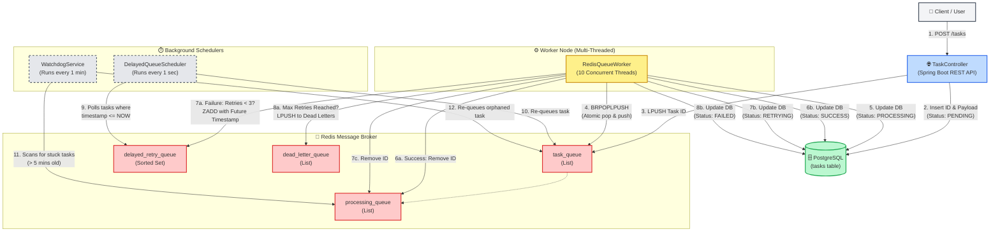

```mermaid
graph TD
    %% Styling Classes
    classDef client fill:#f3f4f6,stroke:#374151,stroke-width:2px;
    classDef api fill:#bfdbfe,stroke:#2563eb,stroke-width:2px;
    classDef redis fill:#fecaca,stroke:#dc2626,stroke-width:2px;
    classDef db fill:#bbf7d0,stroke:#16a34a,stroke-width:2px;
    classDef worker fill:#fef08a,stroke:#ca8a04,stroke-width:2px;
    classDef scheduler fill:#e5e7eb,stroke:#4b5563,stroke-width:2px,stroke-dasharray: 5 5;

    Client["📱 Client / User"]:::client
    API["🌐 TaskController<br/>(Spring Boot REST API)"]:::api
    DB[("🗄️ PostgreSQL<br/>(tasks table)")]:::db

    subgraph "🔴 Redis Message Broker"
        TQ["task_queue<br/>(List)"]:::redis
        PQ["processing_queue<br/>(List)"]:::redis
        DQ["delayed_retry_queue<br/>(Sorted Set)"]:::redis
        DLQ["dead_letter_queue<br/>(List)"]:::redis
    end

    subgraph "⚙️ Worker Node (Multi-Threaded)"
        Worker["RedisQueueWorker<br/>(10 Concurrent Threads)"]:::worker
    end

    subgraph "⏱️ Background Schedulers"
        Watchdog["WatchdogService<br/>(Runs every 1 min)"]:::scheduler
        DelayPoller["DelayedQueueScheduler<br/>(Runs every 1 sec)"]:::scheduler
    end

    %% API Flow
    Client -- "1. POST /tasks" --> API
    API -- "2. Insert ID & Payload<br/>(Status: PENDING)" --> DB
    API -- "3. LPUSH Task ID" --> TQ

    %% Worker Flow
    Worker -- "4. BRPOPLPUSH<br/>(Atomic pop & push)" --> TQ
    TQ -.-> PQ
    Worker -- "5. Update DB<br/>(Status: PROCESSING)" --> DB
    
    %% Success Flow
    Worker -- "6a. Success: Remove ID" --> PQ
    Worker -- "6b. Update DB<br/>(Status: SUCCESS)" --> DB

    %% Failure Flow (Retry)
    Worker -- "7a. Failure: Retries < 3?<br/>ZADD with Future Timestamp" --> DQ
    Worker -- "7b. Update DB<br/>(Status: RETRYING)" --> DB
    Worker -- "7c. Remove ID" --> PQ

    %% Failure Flow (DLQ)
    Worker -- "8a. Max Retries Reached?<br/>LPUSH to Dead Letters" --> DLQ
    Worker -- "8b. Update DB<br/>(Status: FAILED)" --> DB

    %% Schedulers Flow
    DelayPoller -- "9. Polls tasks where<br/>timestamp <= NOW" --> DQ
    DelayPoller -- "10. Re-queues task" --> TQ
    
    Watchdog -- "11. Scans for stuck tasks<br/>(> 5 mins old)" --> PQ
    Watchdog -- "12. Re-queues orphaned task" --> TQ
```

